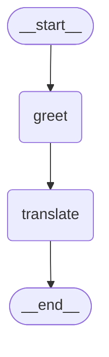

# Day1 - LangGraph 基础入门

> 今天我们正式开启 LangGraph 学习之旅。本日聚焦:LangGraph 是什么、为什么需要它、如何搭建环境,以及亲手写出第一个状态图。

---

## 一、当日目标

1. 理解 LangGraph 的定位与核心设计理念,能说清楚它和 LangChain 的关系。
2. 完成本地环境搭建,运行出第一个 LangGraph 程序。
3. 掌握 `StateGraph`、`Node`、`Edge`、`State` 四个核心概念,能画出图的结构示意图。
4. 独立编写并运行一个"打招呼 + 翻译"的两节点状态图。

---

## 二、LangGraph 简介

### 2.1 什么是 LangGraph

LangGraph 是 LangChain 团队推出的**用于构建有状态、多角色 LLM 应用的框架**。它的核心思想是:**用图(Graph)来建模应用的工作流**。

- 节点(Node):代表一个处理步骤,通常是一个函数,接收状态、返回状态更新。
- 边(Edge):代表节点之间的流转关系,可以是固定边,也可以是条件边。
- 状态(State):在整个图中流转的共享数据结构,由你定义。

一句话概括:**LangGraph 让你像画流程图一样构建 LLM 应用,而且这个流程图是有状态、可持久化、可中断、可恢复的。**

### 2.2 为什么需要 LangGraph

传统 LangChain 的链(Chain)是线性的:`A → B → C`。但真实的 Agent 应用往往:

- 需要**循环**(ReAct 模式:思考 → 行动 → 观察 → 再思考)。
- 需要**条件分支**(根据 LLM 输出走不同路径)。
- 需要**持久化记忆**(多轮对话记住历史)。
- 需要**人机协同**(关键操作需要人工批准)。

这些用线性链很难优雅表达,而图的天然结构可以轻松描述循环、分支、并发。LangGraph 正是为这类场景而生。

### 2.3 LangGraph 与 LangChain 的关系

- LangGraph 是 **LangChain 生态的一部分**,但可以**独立使用**。
- 你可以在 LangGraph 中使用 LangChain 的 LLM、Tool、Prompt 等组件。
- 也可以完全不依赖 LangChain,只用 LangGraph + 原生 OpenAI SDK。
- 安装:`pip install langgraph`(最小依赖);如需 LangChain 集成再装 `langchain`、`langchain-openai`。

---

## 三、环境搭建

### 3.1 创建虚拟环境并安装依赖

```bash
# 创建项目目录
mkdir langgraph-demo && cd langgraph-demo

# 创建虚拟环境
python -m venv .venv

# 激活虚拟环境
# Windows:
.venv\Scripts\activate
# macOS/Linux:
source .venv/bin/activate

# 安装核心依赖
pip install langgraph langgraph-checkpoint-sqlite langchain-openai langchain-community

# 验证安装
python -c "import langgraph; print(langgraph.__version__)"
```

预期输出类似 `0.2.x`。

### 3.2 配置 API Key

如使用 OpenAI,设置环境变量:

```bash
# Windows PowerShell
$env:OPENAI_API_KEY="sk-你的key"

# macOS/Linux
export OPENAI_API_KEY="sk-你的key"
```

也可以在代码中通过 `dotenv` 加载 `.env` 文件。建议项目根目录放一个 `.env`:

```
OPENAI_API_KEY=sk-你的key
```

代码中加载:

```python
from dotenv import load_dotenv
load_dotenv()
```

### 3.3 验证环境

创建 `hello.py`:

```python
import os
from langchain_openai import ChatOpenAI

llm = ChatOpenAI(model="gpt-4o-mini")
response = llm.invoke("用一句话介绍 LangGraph")
print(response.content)
```

运行 `python hello.py`,如果输出正常,环境就绪。

---

## 四、核心概念详解

### 4.1 State(状态)

State 是在图中流转的共享数据结构。最常用的定义方式是用 `TypedDict`:

```python
from typing import TypedDict, Annotated
from langgraph.graph.message import add_messages

class MyState(TypedDict):
    messages: Annotated[list, add_messages]
    user_name: str
```

- `messages`:消息列表,使用 `add_messages` Reducer(明天详细讲)实现追加而非覆盖。
- `user_name`:普通字段,默认覆盖语义。

### 4.2 Node(节点)

节点是一个函数,签名是 `def node(state: State) -> dict`。它接收当前状态,返回一个**状态更新字典**。

```python
def greet(state: MyState) -> dict:
    name = state["user_name"]
    return {"messages": [{"role": "ai", "content": f"你好,{name}!"}]}
```

注意:返回的字典只需要包含要更新的字段,不是全量状态。

### 4.3 Edge(边)

边定义节点之间的流转。三种主要类型:

1. **普通边**:固定从 A 到 B。
2. **条件边**:根据状态决定下一个节点。
3. **入口/出口边**:连接 `START` 到首个节点、末节点到 `END`。

```python
from langgraph.graph import StateGraph, START, END

graph_builder = StateGraph(MyState)
graph_builder.add_node("greet", greet)
graph_builder.add_edge(START, "greet")
graph_builder.add_edge("greet", END)
```

### 4.4 编译与运行

图构建后需要**编译**成可执行对象:

```python
graph = graph_builder.compile()

# 运行
result = graph.invoke({"user_name": "小明", "messages": []})
print(result["messages"][-1]["content"])
```

`compile()` 还可以传入 `checkpointer`(Day4 讲)、`interrupt_before`(Day5 讲)等参数。

---

## 五、第一个完整示例:打招呼 + 翻译

我们构建一个两节点图:
- `greet` 节点:根据用户名生成问候语。
- `translate` 节点:把问候语翻译成英文。
- 流转:`START → greet → translate → END`

### 5.1 完整代码

```python
"""Day1 第一个 LangGraph 示例:打招呼 + 翻译"""
import os
from typing import TypedDict, Annotated
from dotenv import load_dotenv
from langchain_openai import ChatOpenAI
from langgraph.graph import StateGraph, START, END
from langgraph.graph.message import add_messages

# 加载环境变量
load_dotenv()


# 1. 定义状态
class GreetState(TypedDict):
    messages: Annotated[list, add_messages]
    user_name: str
    greeting_cn: str
    greeting_en: str


# 2. 定义节点函数
def greet_node(state: GreetState) -> dict:
    """生成中文问候"""
    name = state["user_name"]
    greeting = f"你好,{name}!欢迎来到 LangGraph 的世界。"
    return {
        "greeting_cn": greeting,
        "messages": [{"role": "assistant", "content": greeting}],
    }


def translate_node(state: GreetState) -> dict:
    """把中文问候翻译成英文"""
    llm = ChatOpenAI(model="gpt-4o-mini", temperature=0)
    prompt = f"请把下面这句中文翻译成英文,只输出译文:\n{state['greeting_cn']}"
    response = llm.invoke(prompt)
    greeting_en = response.content
    return {
        "greeting_en": greeting_en,
        "messages": [{"role": "assistant", "content": greeting_en}],
    }


# 3. 构建图
def build_graph():
    builder = StateGraph(GreetState)
    builder.add_node("greet", greet_node)
    builder.add_node("translate", translate_node)

    builder.add_edge(START, "greet")
    builder.add_edge("greet", "translate")
    builder.add_edge("translate", END)

    return builder.compile()


# 4. 运行
def main():
    graph = build_graph()
    initial_state = {
        "user_name": "小明",
        "messages": [],
        "greeting_cn": "",
        "greeting_en": "",
    }
    result = graph.invoke(initial_state)
    print("=== 运行结果 ===")
    print(f"用户:{result['user_name']}")
    print(f"中文问候:{result['greeting_cn']}")
    print(f"英文问候:{result['greeting_en']}")
    print(f"消息历史条数:{len(result['messages'])}")


if __name__ == "__main__":
    main()
```

### 5.2 预期输出

```
=== 运行结果 ===
用户:小明
中文问候:你好,小明!欢迎来到 LangGraph 的世界。
英文问候:Hello, Xiao Ming! Welcome to the world of LangGraph.
消息历史条数:2
```

### 5.3 理解状态流转

1. 初始状态进入 `greet` 节点,`greet` 返回 `greeting_cn` 和一条消息。
2. 更新后的状态进入 `translate` 节点,`translate` 读取 `greeting_cn`,调用 LLM 翻译,返回 `greeting_en` 和一条消息。
3. 状态到达 `END`,最终结果包含所有字段。

关键点:`messages` 因为用了 `add_messages` Reducer,所以是**追加**;而 `greeting_cn` 等普通字段是**覆盖**。

---

## 六、可视化图结构(可选)

LangGraph 支持导出图的 Mermaid 图或 PNG。在 Jupyter 中:

```python
from IPython.display import Image, display
display(Image(graph.get_graph().draw_mermaid_png()))
```

也可以打印 Mermaid 文本:

```python
print(graph.get_graph().draw_mermaid())
```

输出类似:



如果你在 VS Code 中,可以安装 Mermaid 预览插件直接看图。

---

## 七、当日小结

- LangGraph 用**图**建模 LLM 应用,擅长处理循环、分支、持久化、人机协同。
- 它是 LangChain 生态的一部分,但可独立使用。
- 四个核心概念:
  - **State**:共享数据结构,通常用 `TypedDict` 定义。
  - **Node**:处理函数,`def node(state) -> dict`。
  - **Edge**:流转关系,包括普通边和条件边。
  - **Compile**:`builder.compile()` 生成可运行图。
- 节点返回的是**增量更新字典**,不是全量状态。
- `add_messages` Reducer 让 `messages` 字段追加而非覆盖。

---

## 八、练习题

### 选择题

**1. LangGraph 中,节点函数的返回值应该是?**
A. 完整的新状态对象
B. 一个只包含需要更新字段的字典
C. 一个布尔值表示是否成功
D. 直接返回 LLM 的 response 对象

**2. 下列关于 LangGraph 与 LangChain 关系的说法,正确的是?**
A. LangGraph 必须依赖 LangChain 才能使用
B. LangGraph 是 LangChain 的替代品,二选一
C. LangGraph 是 LangChain 生态的一部分,但可独立使用
D. LangGraph 只能用于非 LLM 场景

**3. 下列哪个不是 LangGraph 图的必要组成部分?**
A. State 定义
B. 至少一个 Node
C. Checkpointer
D. START 到首节点的边

### 填空题

**4.** 编译图的函数是 `StateGraph` 实例的 `______` 方法。

**5.** 连接图起点和终点的两个特殊常量分别是 `______` 和 `______`。

**6.** 使用 `Annotated[list, add_messages]` 的作用是让 messages 字段在节点间以 ______ 方式更新(而非覆盖)。

### 编程题

**7.** 修改本日的完整示例,新增一个 `farewell` 节点,在 `translate` 之后生成一句英文告别语(如 "Goodbye and good luck!"),并把它追加到 messages。画出新的流转:`START → greet → translate → farewell → END`。

**8.** 不使用 LLM,编写一个纯计算的两节点图:`input` 节点接收一个数字 n,`square` 节点计算 n 的平方并存入 state。运行后输出平方结果。

---

## 九、练习题答案

### 1. 答案:B
解析:节点函数返回增量更新字典。LangGraph 会把这个字典与当前状态合并,只更新返回的字段,其他字段保持不变。返回全量状态虽然也能跑,但违背设计意图且容易引入 bug。

### 2. 答案:C
解析:LangGraph 可以独立安装 `pip install langgraph` 使用,也可以与 LangChain 组件配合。它不是替代品,而是补充——专门处理有状态、有循环、有分支的复杂工作流。

### 3. 答案:C
解析:Checkpointer 是可选的(Day4 才讲),用于持久化。State、Node、入口边都是构建可运行图的必要部分。

### 4. 答案:`compile()`
解析:`graph = builder.compile()` 将构建器编译为可执行的 `CompiledGraph`。

### 5. 答案:`START`、`END`
解析:从 `langgraph.graph` 导入:`from langgraph.graph import START, END`。它们是图的虚拟入口和出口节点。

### 6. 答案:追加(append / 累加)
解析:`add_messages` 是一个 Reducer 函数,它把节点返回的新消息追加到现有列表末尾,而不是用新列表替换旧列表。这让消息历史的累积变得自然。

### 7. 参考代码

```python
"""Day1 练习题7:新增 farewell 节点"""
import os
from typing import TypedDict, Annotated
from dotenv import load_dotenv
from langchain_openai import ChatOpenAI
from langgraph.graph import StateGraph, START, END
from langgraph.graph.message import add_messages

load_dotenv()


class GreetState(TypedDict):
    messages: Annotated[list, add_messages]
    user_name: str
    greeting_cn: str
    greeting_en: str
    farewell_en: str


def greet_node(state: GreetState) -> dict:
    name = state["user_name"]
    greeting = f"你好,{name}!欢迎来到 LangGraph 的世界。"
    return {
        "greeting_cn": greeting,
        "messages": [{"role": "assistant", "content": greeting}],
    }


def translate_node(state: GreetState) -> dict:
    llm = ChatOpenAI(model="gpt-4o-mini", temperature=0)
    prompt = f"请把下面这句中文翻译成英文,只输出译文:\n{state['greeting_cn']}"
    response = llm.invoke(prompt)
    return {
        "greeting_en": response.content,
        "messages": [{"role": "assistant", "content": response.content}],
    }


def farewell_node(state: GreetState) -> dict:
    llm = ChatOpenAI(model="gpt-4o-mini", temperature=0)
    prompt = (
        f"用英文给 {state['user_name']} 写一句简短的告别语,只输出告别语本身。"
    )
    response = llm.invoke(prompt)
    return {
        "farewell_en": response.content,
        "messages": [{"role": "assistant", "content": response.content}],
    }


def build_graph():
    builder = StateGraph(GreetState)
    builder.add_node("greet", greet_node)
    builder.add_node("translate", translate_node)
    builder.add_node("farewell", farewell_node)

    builder.add_edge(START, "greet")
    builder.add_edge("greet", "translate")
    builder.add_edge("translate", "farewell")
    builder.add_edge("farewell", END)
    return builder.compile()


def main():
    graph = build_graph()
    result = graph.invoke({
        "user_name": "小明",
        "messages": [],
        "greeting_cn": "",
        "greeting_en": "",
        "farewell_en": "",
    })
    print("英文问候:", result["greeting_en"])
    print("英文告别:", result["farewell_en"])
    print("消息总数:", len(result["messages"]))


if __name__ == "__main__":
    main()
```

### 8. 参考代码

```python
"""Day1 练习题8:纯计算两节点图"""
from typing import TypedDict
from langgraph.graph import StateGraph, START, END


class CalcState(TypedDict):
    n: int
    square: int


def input_node(state: CalcState) -> dict:
    # 这里直接从 state 取 n,实际可做校验
    return {"n": state["n"]}


def square_node(state: CalcState) -> dict:
    return {"square": state["n"] ** 2}


builder = StateGraph(CalcState)
builder.add_node("input", input_node)
builder.add_node("square", square_node)
builder.add_edge(START, "input")
builder.add_edge("input", "square")
builder.add_edge("square", END)

graph = builder.compile()
result = graph.invoke({"n": 7, "square": 0})
print(f"7 的平方是 {result['square']}")  # 输出 49
```

---

恭喜完成 Day1!你已迈出 LangGraph 的第一步。

下一站:[02-Day2-状态管理.md](02-Day2-状态管理.md)
